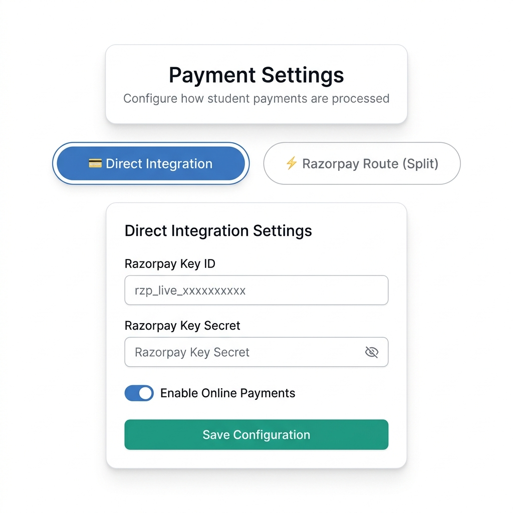
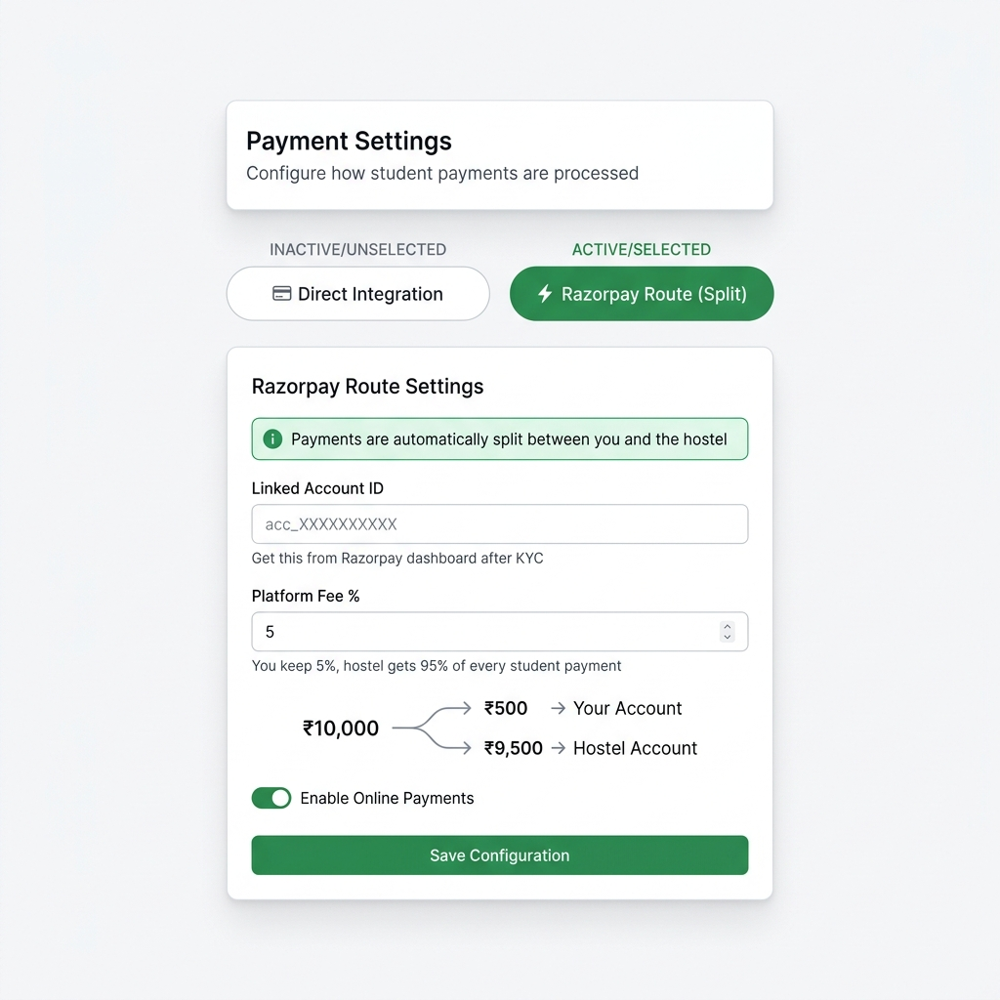

# Payment Settings UI — Visual Guide for Frontend Team

## What does `● Direct Integration   ○ Razorpay Route` mean?

It is simply **two clickable tab buttons** at the top of the existing Payment Settings form.  
Think of it like a **segmented control** — clicking each tab shows different fields below it.

---

## Screen 1 — "Direct Integration" tab selected (current / existing behavior)



**What the team sees:**
- `💳 Direct Integration` = **highlighted** (blue, filled)
- `⚡ Razorpay Route` = not selected (white, gray border)
- Form shows the **existing fields**: Key ID + Key Secret
- This is what the page looks like today — no change to this mode

---

## Screen 2 — "Razorpay Route" tab selected (new behavior)



**What the team sees:**
- `⚡ Razorpay Route` = **highlighted** (green, filled)
- `💳 Direct Integration` = not selected (white, gray border)
- Form shows **NEW fields**: Linked Account ID + Platform Fee %
- Key ID and Key Secret fields are **completely hidden**

---

## Side-by-side Comparison

| | 💳 Direct Integration | ⚡ Razorpay Route |
|---|---|---|
| Tab state | Active (filled color) | Inactive (white) |
| Field 1 | Razorpay Key ID | Linked Account ID (`acc_xxx`) |
| Field 2 | Razorpay Key Secret | Platform Fee % (e.g. `5`) |
| Field 3 | Webhook Secret | *(none)* |
| Who sets it | Hostel Admin | Super Admin only |
| Money flow | Goes to hostel's Razorpay | Auto-split by Razorpay |

---

## How to Build the Toggle (Simple HTML/React)

```jsx
// Two buttons that look like tabs — nothing fancy
const [mode, setMode] = useState("direct");

<div style={{ display: "flex", gap: "8px", marginBottom: "24px" }}>
  
  <button
    onClick={() => setMode("direct")}
    style={{
      padding: "10px 20px",
      borderRadius: "8px",
      border: "2px solid",
      backgroundColor: mode === "direct" ? "#3B82F6" : "white",
      color: mode === "direct" ? "white" : "#6B7280",
      borderColor: mode === "direct" ? "#3B82F6" : "#D1D5DB",
      cursor: "pointer",
      fontWeight: "600"
    }}
  >
    💳 Direct Integration
  </button>

  <button
    onClick={() => setMode("route")}
    style={{
      padding: "10px 20px",
      borderRadius: "8px",
      border: "2px solid",
      backgroundColor: mode === "route" ? "#10B981" : "white",
      color: mode === "route" ? "white" : "#6B7280",
      borderColor: mode === "route" ? "#10B981" : "#D1D5DB",
      cursor: "pointer",
      fontWeight: "600"
    }}
  >
    ⚡ Razorpay Route (Split)
  </button>

</div>

{/* Show different fields based on which tab is active */}
{mode === "direct" && <DirectIntegrationForm />}
{mode === "route"  && <RazorpayRouteForm />}
```

---

## Full Task Details

See [frontend_payment_route_task.md](../frontend_payment_route_task.md) for the complete step-by-step code guide.

## API Swagger Docs

`https://hostel-final-cqes.onrender.com/docs`
